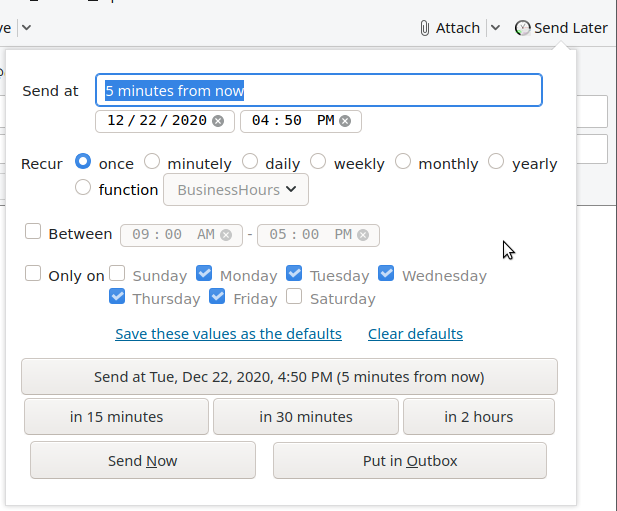
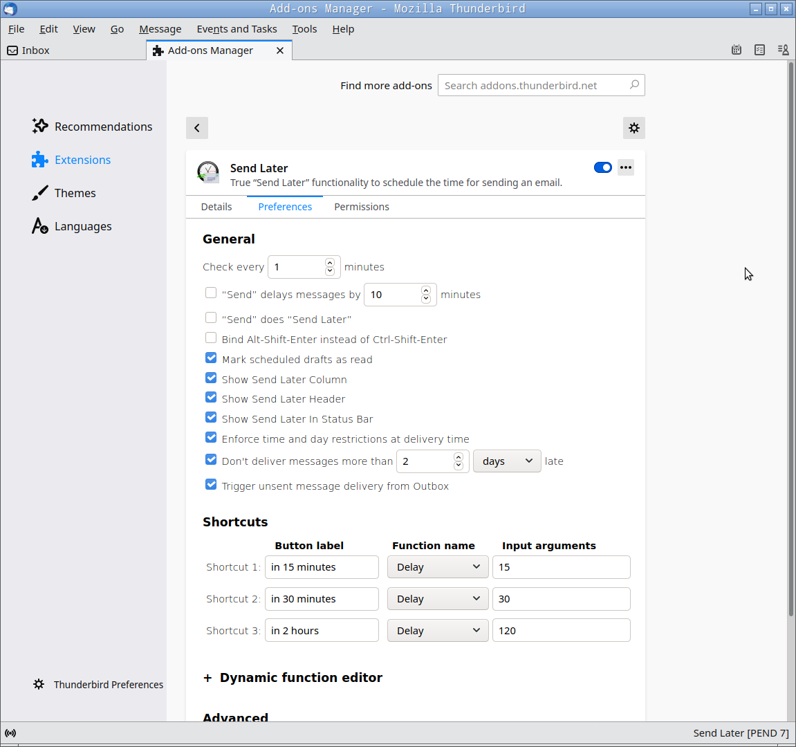
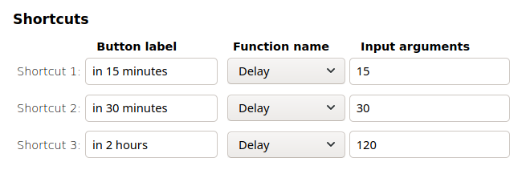
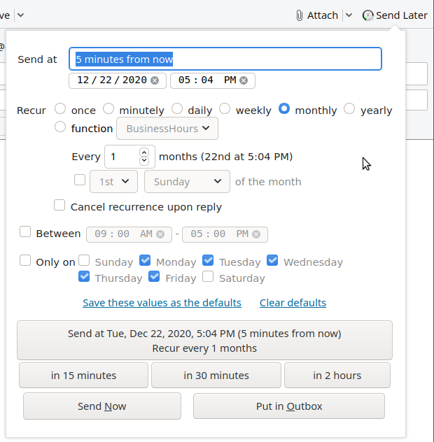

* TOC
{:toc}

Introduction
----------------------------

The Send Later Thunderbird add-on allows you you to write an email message and
then tell Thunderbird when you want it to be sent. The message is saved into
your Drafts folder, and delivered at approximately the specified time. The
add-on is available for download from
[addons.thunderbird.net](https://addons.thunderbird.net/thunderbird/addon/send-later-3/).
Release notes for each new version of Send Later are published there and
[on GitHub](https://github.com/Extended-Thunder/send-later/releases).
What follows is a user manual for the add-on.
Everything below (except for the [installation section](#install)) assumes that
you've already installed the add-on and restarted Thunderbird.

If you have any comments, questions, or feedback about the add-on, please
[get in touch](#help).

*This user manual is written for Thunderbird 78 or newer. Things might be
slightly different for older versions.*

<a name="install"></a>

Installation
------------------------------

### Method 1

1.  In Thunderbird, open the extension manager with the `Tools > Add-ons`
    menu-bar command or `Add-ons` from the hamburger menu in the upper right
    corner of the main Thunderbird window.
2.  Enter "Send Later" in the search box and hit Enter.
3.  Find the "Send Later" add-on in the search results and click the
    "Add to Thunderbird" button. Click "OK" when prompted.
4.  Recommended: restart Thunderbird when it's done installing.

### Method 2 (use only if Method 1 doesn't work)

1.  Download the add-on as an ".xpi" file from
    [addons.thunderbird.net](https://addons.thunderbird.net/thunderbird/addon/send-later-3/),
    saving it to your Desktop or another obvious location.
    * Note: download the file using `Right click > Save link as`, otherwise
      your web browser might think you are trying to install a browser extension.
2.  In Thunderbird, select the `Tools > Add-ons` menu-bar command or `Add-ons`
    from the hamburger menu.
3.  From here you can either drag-drop the `.xpi` file into Thunderbird, or
    click the gear icon at the top of the page, select
    `Install Add-on From File...`, and browse to the path of your downloaded
    `.xpi` package.
4.  Recommended: restart Thunderbird after the add-on is installed.

Basic usage
---------------------------

When you want to schedule a message for later delivery, either select the
`File > Send Later` menu command in the message composition window, or hit
`Ctrl-Shift-Enter`, or click on the "Send Later" button in the composition
window's toolbar. This will pop up the following dialog:



Here is what you can do from this dialog:

-   **Specify a specific time at which to send the message.** Tell Send
    Later in the text box when you would like the message to be sent, or
    use the date and time pickers below the text box if you prefer. The
    text box understands [lots of different formats](#date-formats), so
    give it a try! When you've entered a date/time that the add-on (thinks it)
    understands, the button below it will show you what it believes you meant
    and allow you to schedule the message to send at that time.
-   **Schedule a recurring message.** See [below](#recurring).
-   **Schedule a one-shot or recurring message using one of the built-in scheduling functions, or a function you've written or imported yourself.** See [below](#dynamic).
-   **Send the message using one of the shortcut buttons.** Click "15 mins
    later", "30 mins later", or "2 hours later" to send the message the
    indicated amount of time into the future. The functionality of these
    shortcuts can be customized.
-   **Deposit the message into your Outbox for later delivery by Thunderbird.**
    If you click "Put in Outbox" the message will be copied immediately into
    your Outbox. This is the behavior of the standard Thunderbird "Send Later"
    command before you installed the add-on. The message will then be sent if
    you execute `File > Send Unsent Messages`, or if you go into and out of
    offline mode, or if you exit and restart Thunderbird. In the latter two cases,
    Thunderbird may or may not prompt for confirmation before sending
    unsent messages, depending on how you have configured it.
-   **Send the message immediately.** If you click "Send Now" the
    message will be delivered immediately, as if you had executed the
    "Send" command instead of "Send Later". Note that you can activate
    this button by hitting Alt+Shift+N or the equivalent on your platform or
    in your language.

### Time-of-day and day-of-week restrictions

You can also specify time-of-day and day-of-week restrictions for when
your message will be delivered.

These restrictions have different (but, I hope, somewhat intuitive) effects
based on what kind of scheduling you are doing:

-   If you enter restrictions with an explicit, one-shot (i.e., not recurring)
    send time, then Send Later will adjust the send time you specify to fall
    within those restrictions. Furthermore,
-   If you enter restrictions with a [recurring send time](#recurring) or
    [dynamic scheduling function](#dynamic), then they will be applied as above
    and also each time the message is rescheduled. If Thunderbird can't send
    the message at the scheduled time, the restrictions you specify will be
    enforced when it *can* send the message-- if the "Enforce time and day
    restrictions at delivery time" preference (see [below](#prefs)) is enabled.

### Saving defaults

You can save whatever settings you enter here as the default settings
for when you bring up this dialog in the future, or clear previously
saved defaults, by making the appropriate selection above the big
scheduled send button.

You can do some pretty fancy things with this. For example, if you enter "now"
in the text box and check that you only want the message to be delivered between
9:00am and 5:00pm Monday through Friday, and then save those as your defaults,
then whenever you pop up the dialog, the default behavior will be to send the
message now or reschedule it for when it is during business hours. Nifty, eh?

### The "Put in Outbox" and "Send Now" buttons

As noted above, the "Send Now" button in the Send Later dialog causes
the message to be sent immediately, i.e., it bypasses the scheduled send
process, and the "Put in Outbox" button causes the message to be put
directly into the Thunderbird Outbox, also bypassing the scheduled send
process, but in a different way.

### What happens when you schedule a message?

When you schedule a message for delivery, it is saved in your Drafts
folder with the necessary scheduling information embedded in it. If you
wish to reschedule a message later, just edit the saved draft and do
"Send Later" again to specify the new send time. If you wish to cancel
a scheduled message delivery, edit the draft and save it normally
without "Send Later" (or just send it immediately, if that's what you
want to do), and the scheduling information will be removed.

<a name="date-formats"></a>
### Date formats

The part of Send Later that interprets the send times you type into the
text box is pretty smart. You're welcome to type a full date and time,
e.g., "10/4/2012 3:00pm", if you *want* to, but it isn't actually
necessary. In addition to making intelligent guesses about the parts you
leave out, the interpreter also understands quite a few neat shortcuts.
Here are some examples, but they don't include everything, so when in
doubt, try it out, and see if it works!

-   Don't type the year if the date you're entering is in the coming
    year. It'll default to that automatically!
-   Don't type the date at all if you're just entering a time in the
    next 24 hours.
-   You can type a day of the week for the next instance of that day, or
    "next *day-of-week*" for the one after.
-   You can type "tomorrow" or "the day after tomorrow".
-   You can type "in 3 minutes" or "3 minutes from now".

See [this page](https://sugarjs.com/dates/#/Parsing) for more examples.
These apply in all of the languages that Send Later supports, not just
in English. If you encounter something you think the add-on should
understand but doesn't,
[let us know](#help).

<a name="prefs"></a>

Preferences
---------------------------

You can get to the add-on's preferences page in two ways:

1.  Click on "Send Later" in the status bar at the bottom of your main
    window and select "Send Later preferences" from the pop-up menu. The
    preferences will open in a new tab.
2.  Select "Add-ons" from the hamburger menu or the Tools menu. The extension
    manager will open in a new tab. Click on "Send Later", and then on the
    "Preferences" tab.

Here is the main preferences screen, followed by explanations of the
various settings:



### Check every <u>&nbsp;#&nbsp;</u> minutes

This preference controls how often the add-on checks for messages whose
delivery time has arrived. The default, once per minute, is adequate for
most people. In rare cases, you may need to use a higher value (lower
frequency) if you have a very large number of messages in your Drafts
folder and the Send Later status indicator at the bottom of your Thunderbird
window is constantly "Checking".

### "Send" does "Send Later"

If it is enabled, this preference causes the scheduling dialog to pop up
not only when you run the "Send Later" command, but also, when you run
"Send", whether it's by clicking the "Send" button, selecting `File >
Send Now`, or typing `Ctrl-Enter`. It'll therefore prevent you from
accidentally sending a message now that you meant to schedule for later.
This feature is *not* enabled by default.

Note that this preference and the following one are mutually exclusive.

### "Send" delays messages by: <u>&nbsp;#&nbsp;</u> minutes

If enabled, this preference causes all messages you send by clicking
Send or typing `Ctrl-Enter` to be automatically scheduled to be sent by
Send Later at the specified number of minutes into the future.

This essentially replicates the functionality provided by some email
providers to allow you to cancel sending a message for a short period of
time after it is sent. If you sent a message and then change your mind
before the delay time has elapsed, you can simply find the message in
your Drafts folder and either delete it (if you don't want it to be sent
at all) or open it for editing, which automatically cancels the
scheduled send.

Note that this preference and the previous one are mutually exclusive.

### Mark scheduled drafts as read

By default when Send Later saves a scheduled messages into your Drafts
folder, it marks the message as "read" so that your Drafts folder
doesn't show up in the folder list as having unread messages in it. If
you prefer for scheduled Drafts to show up as "unread" to remind you
that they're there, then uncheck this preference.

### Bind Alt-Shift-Enter instead of Ctrl-Shift-Enter

This preference causes the pop-up Send Later dialog to be bound to the
key sequence Alt-Shift-Enter instead of `Ctrl-Shift-Enter`. When this
feature is activated, `Ctrl-Shift-Enter` reverts to the original Thunderbird
functionality, i.e. depositing the message into the Outbox.

### Show Send Later Column

This preference controls whether a column showing the scheduled delivery
times of messages that have them is displayed when viewing a Drafts folder.

### Show Send Later Header

This preference controls whether the Send Later schedule should be displayed
alongside the "From" "Subject" and "To" fields when viewing messages that have
Send Later headers.

### Show Send Later in Status Bar

This preference controls whether the add-on shows its current status in the
Status Bar at the bottom of the Thunderbird window. The number of pending
scheduled messages, or "IDLE" is displayed if there are none.

### Trigger unsent message delivery from Outbox

This preference controls whether the add-on actually sends messages when
their delivery time arrives, or rather should just deposit them into
your Outbox and leave them there until the next time you send unsent
messages as described above. You might want to disable this setting if
you use some other add-on to manage your message delivery. See the
[Caveats section below](#caveats) for more information about this.

### Enforce time and day restrictions at delivery time

As described [below](#recurring), Send Later supports restrictions on
the time of day and day of the week when recurring scheduled messages
are delivered. These restrictions are enforced when a message is
scheduled, i.e., the scheduled send time of a message will never violate
the time and weekday restrictions specified for that message.

Having said that, this preference controls what happens when a message
isn't delivered at its scheduled time because Thunderbird isn't running
or your computer is asleep, and then when Thunderbird wakes up, the
current time violates the time and/or weekday restrictions on the
message. By default, when this preference is disabled, Send
Later delivers late messages immediately even in violation of their
time/weekday restrictions. In contrast, when the preference is enabled,
the add-on waits until the time/weekday restrictions are satisfied
before delivery.

### Don't deliver messages more than <u>&nbsp;#&nbsp;</u> minutes late

This preference controls what happens when Send Later encounters a message that
was scheduled to send some time in the past. This can happen if Thunderbird was
closed, or the computer was asleep at the actual scheduled time. If this option
is disabled, those messages will be sent immediately next time Send Later is
able to do so. If this option is enabled, then Send Later will pop up a warning
about any such messages and leave them for you to reschedule by editing the
relevant draft message by hand.

### Shortcut buttons

In addition to these main settings, you can change the behavior of the
shortcut buttons. Each of these buttons is bound to a
[dynamic function](#dynamic), which by default is set to perform a simple
delay. However, you can choose any dynamic function you'd like, or write your
own using the dynamic function editor, described below. Each button can pass
different arguments to the dynamic function, thereby enabling you to reuse a
single function for multiple shortcuts.

The shortcuts can be accessed from within a message composition window using the
keyboard commands `Ctrl+Alt+1`, `Ctrl+Alt+2`, and`Ctrl+Alt+3`, or from within
the scheduler popup dialog using `Ctrl+1`, `Ctrl+2`, and `Ctrl+3`.



-   **Button label** specifies the string that is displayed in the
    button.

    You can bind shortcuts to "[access keys](https://www.w3schools.com/jsref/prop_html_accesskey.asp)" by placing an `&` in front of any letter. For
    example, setting a button label to `&Business hours` will be displayed in the scheduler dialog as "<u>B</u>usiness hours", and can be activated with
    `Alt+Shift+B` (`Ctrl+Option+B` on Mac). Note: this assumes that nothing else
    in the dialog is bound to Alt+Shift+B, which may not be the case depending on
    your language settings.
-   **Function name** Specifies which [dynamic function](#dynamic) will be
    attached to this shortcut button.
-   **Input arguments** Arguments that will be passed to the dynamic function
    that may modify its behavior. See the section on
    [dynamic functions](#dynamic) for details on what these arguments can do.

### Dynamic function editor

You can create and edit your own scheduling and recurrence functions by
writing JavaScript code in the function editor. See the documentation
on [dynamic scheduling functions](#dynamic) for how these functions work.

The interface allows you to select an existing function to edit, or create a
new one. You can input a function name, the body of the function, and a block
of help text in the following fields.

You can test your function by entering input values in the `test` area,
including a date/time, which will be passed as the `prev` argument, and a set
of arguments, which will be parsed into an array and passed as the `nextargs`
variable to your function. The `specname`input variable will always correspond
to the name of your function. The `Execute function` button will evaluate your
function using those inputs, and display its outputs and any error messages in
the adjacent output box.

Note that the builtin functions cannot be edited, but they can be copied/pasted
into new functions. They provide a good starting point for creating your own
scheduling functions.

<a name="config-editor"></a>
### Advanced configuration editor

There are some preferences which do not have corresponding UI elements in the
options dialog. Also, there are occasions where you just need fine-grained
control over your preferences. The advanced configuration editor allows you
to modify all of Send Later's preferences manually, using JSON-formatted input.
Hopefully the interface is pretty self explanatory, but I highly recommend
avoiding this feature unless you know what you're doing.

### Console log level

Controls how much detail you want to see in the debug console. Setting this to
"Debug", "Trace", or "All" will make Send Later very chatty, and can actually
start to slow down Thunderbird over time as the debug log gets very long.
I recommend leaving this on the default "Info" level unless you need to
investigate the source of a bug.

### Reset preferences

Resets all preferences to their default state. Will prompt for confirmation
before proceeding, but cannot be undone without manually setting everything
again by hand.

<a name="caveats"></a>

Caveats and known issues
------------------------------------------

Some things to keep in mind:

1.  Whenever Send Later delivers a scheduled message, any other messages
    pending delivery in your Outbox will also be delivered. This is assuming
    Send Later is configured to deliver unsent messages at send time (see the
    "Trigger unsent message delivery from Outbox" [preference](#prefs)).
2.  Scheduled drafts are locked to a particular Thunderbird profile and
    will only be delivered by a Thunderbird running against the same
    profile that originally scheduled them. This means that if you use
    Thunderbird on multiple computers to schedule messages, you need to
    keep it running on all of those computers for the messages to be
    delivered. You can "transfer" a draft from one profile to another if
    need be by editing and rescheduling it.
3.  If you use distribution lists within Thunderbird and you add a
    distribution list to a message and then Send Later, the list will be
    expanded when you schedule it, *not* when it is sent. Any changes
    you make to the list between when you schedule the message and when
    it is sent will not be reflected in the sent message.
4.  Attachments are frozen when messages are scheduled to be sent. In
    other words, if you attach a file to a message, then schedule the
    message with Send Later, then modify the file on disk before the
    scheduled message is sent, *your modifications will not be included
    in the sent message.* This is also true with recurring messages ---
    when a recurring message is sent and automatically rescheduled, Send
    Later does *not* capture a new version of the attached files.
5.  Outgoing message format preferences
    (`Preferences > Composition > Send Options...`) do not work with Send Later.  
    *Note*: this may no longer be the case, but I haven't checked lately. If
    you do experiment with it let me know the results.
6.  I have been told by multiple people that messages sent from or to iCloud or
    me.com accounts never appear in the recipient's inbox even though
    Thunderbird says they were sent successfully. Please note that this is *not*
    a bug in Send Later or Thunderbird, it's a problem with iCloud. Apparently,
    Apple thinks it's OK to run a mail server which arbitrarily and completely
    silently discards valid email messages with no notification to either the
    sender or recipient that this has occurred (this is discussed by others on
    the internet, e.g.:
    [here](https://www.macworld.com/article/2029570/silent-email-filtering-makes-icloud-an-unreliable-option.html),
    [here](https://discussions.apple.com/thread/3153039),
    [here](https://www.cultofmac.com/103703/apple-may-be-invisibly-filtering-your-outgoing-mobileme-email-exclusive/103703/),
    [here](https://www.imore.com/apple-slipping-lately#comment-610145)).
    I have tried, unfortunately without success, to find a fix or workaround for
    this problem. The only possible fix I've been able to find --- and I'm not
    actually sure it works --- is to check your account settings and confirm
    that the outbound SMTP configuration in Thunderbird for your iCloud account
    matches the
    [settings Apple says you should be using](https://support.apple.com/en-us/HT202304).
7.  <a name="exquilla"></a>Send Later does not work with ExQuilla, because Send
    Later depends on being able to put messages into your local Outbox and then
    send them with the "Send Unsent Messages" command, but
    ["Send Unsent Messages" is not implemented in ExQuilla](https://exquilla.zendesk.com/entries/25723967-Messages-stuck-in-Outbox).
    If you would like to see Send Later work with ExQuilla, I suggest you
    contact the maintainers of ExQuilla and ask them to make sending messages to
    ExQuilla from the local Outbox work properly; the more people ask, the more
    likely it is that they will fix this problem. Send Later *does* work with
    [Owl for Exchange](https://addons.thunderbird.net/thunderbird/addon/owl-for-exchange/),
    the add-on which is intended to replace ExQuilla, when configured as
    described [below](#owl).

<a name="bad-mail-servers"></a>
### Send Later doesn't work with mail servers that discard its "X-Send-Later" headers

Some mail servers (most notably, but not exclusively, Microsoft Exchange used
through its IMAP gateway) prevent Send Later from working by discarding the
`X-Send-Later` headers that it uses to keep track of message scheduled delivery
times. You can tell that this is happening if you schedule a message for
delivery, but there are no `X-Send-Later-` headers when you view the message
with `View > Message Source` (`Ctrl+U`).

To work around this problem, you need to store your drafts for the affected
account in some other Drafts folder, e.g., the one underneath Local Folders.
You can set this preference by going to `Edit > Account Settings...` or
`Hamburger menu > Account Settings...` and viewing the `Copies & Folders` page
for the affected account.

Please note: for Microsoft Exchange in particular, this workaround is
only valid when you are accessing Exchange as a generic IMAP server,
*not* when you are using ExQuilla, which as noted [just above](#exquilla) is
incompatible with Send Later anyway.

### Thunderbird must be running for scheduled messages to be sent

You need to keep Thunderbird running (and your computer turned on!) for
Send Later to be able to send scheduled messages (note that on Mac OS,
"running" means there must be at least one main Thunderbird window open;
Send Later will not work if the Thunderbird app is running but doesn't
have any open windows). It runs within Thunderbird, which means that
when you exit from Thunderbird, it's not around to check for messages to
be sent. If you fail to leave Thunderbird running over the delivery time
of one or more messages, then those messages will be delivered shortly
after the next time you start Thunderbird. Note that there are various
methods and tools for waking up your computer automatically at a
pre-specified time, in case you don't want to keep it running constantly
until it's time to send the messages. For Windows, for example, see:
[\[1\]](http://www.lifsoft.com/),
[\[2\]](http://www.vistax64.com/tutorials/166809-task-scheduler-wake-up-computer.html),
[\[3\]](https://www.pcworld.com/article/158142/Schedule_your_PCs_Startup_and_Program_Launch.html).
For Linux, see
[\[1\]](http://www.osnews.com/story/24111/Wake_Your_Linux_Up_From_Sleep_for_a_Cron_Job).
You can schedule your Mac to wake up automatically by opening System
Preferences and clicking on "Energy Saver" and then "Schedule".
Alternatively, see [below](#server-side) for a description of how to run
Thunderbird on a server to deliver your messages for you.

Or you can consider using a third-party service that holds and delivers
scheduled messages for you, instead of Send Later. See, for example:

-   <http://www.timecave.com/timecave/about.jsp>
-   <http://www.lettermelater.com/>
-   <http://www.rightinbox.com/> (Gmail only)
-   <http://www.boomeranggmail.com/> (Gmail only)

The list of sites above is provided for informational purposes only; it should
not be construed as an endorsement of any of these services. I don't use them
and don't know how well they work or how trustworthy they are.

### Return receipts don't work

If you enable the Return Receipt option on a message you are composing,
and then you schedule the message to be sent later, when it is sent, no
return receipt will be requested. Unfortunately, fixing this requires
significant changes to the internal architecture for how scheduled
messages are sent, and the changes are difficult since the core
Thunderbird components involved are completely undocumented, so I don't
know when I'll be able to find the time to fix the problem. In the
meantime, here's a workaround (thanks to
[about.com](http://email.about.com/od/mozillathunderbirdtips/qt/Add_an_Arbitrary_Custom_Header_to_Mozilla_Thunderbird.htm)):

1.  Open the Thunderbird options dialog with `Edit > Preferences...`
2.  Scroll to the bottom of the "General" page to the `Config Editor...` button
    click the "I'll be careful, I promise!" button if it asks you to.
3.  Enter "mail.compose.other.header" in the filter box.
4.  Double-click on the mail.compose.other.header setting and set it to
    "Disposition-Notification-To". If it already has a non-empty value,
    add a comma and then "Disposition-Notification-To" to the end of it.
5.  Quit from and restart Thunderbird.
6.  When you are composing a message for which you want a return receipt
    and which you want to schedule to be sent later, then click on an
    empty line in the message header in the compose window, select
    "Disposition-Notification-To" in the drop-down, and then enter your
    email address as the value of the header.

If you want to automatically request a return receipt for *every*
message you send, so that you don't have to do it manually each time you
schedule a message to be sent later, do the following (thanks to
[MozillaZine](http://kb.mozillazine.org/Custom_headers)):

1.  Open the advanced configuration editor as described [above](#config-editor).
2.  Enter "useremail" in the filter box and scan through the matches to
    find the email address of the account which you want to generate
    return receipts. Remember the "id*\#*" for that account, where
    "id*\#*" here and below means the characters "id" followed by a
    number which is different for each of your configured accounts.
3.  Enter "mail.identity.id*\#*.headers" to find out if there are
    already custom headers configured for the account. If not, then
    right-click in the settings area to create a new string setting with
    that name.
4.  Put "receipt" as the value of the setting if it's empty, or append
    ",receipt" to the end of the existing value.
5.  Create a new string setting called
    "mail.identity.id*\#*.header.receipt", and set its value to
    "Disposition-Notification-To: *address*", where *address* is the
    email address to which you would like return receipts sent.

### Thunderbird hangs frequently on Windows

*Note 1:* I don't know if this is still a problem, but I'm leaving it here in
case it does come up again.

*Note 2:* One way to avoid any laggy behavior in Thunderbird is to ensure that
the Send Later option "Console log level" is set to "Info" (or "Warn", "Error",
or "Fatal"). High debug log activity seems to bog Thunderbird down over time.

A number of Send Later users on Windows have reported that when they
have Send Later installed, Thunderbird periodically hangs for annoyingly
long periods of time during normal use of the application.

This is not actually a bug in Send Later --- there is nothing Send Later
does that should cause Thunderbird to hang, and some Thunderbird users
on Windows have reported this issue even without Send Later installed
--- but whatever the problem is, Send Later does seem to exacerbate it
for some people.

I heard two different potential explanations for this behavior, one
anecdotal (i.e., I have been unable to confirm it) and one definitive.

First, the definitive one: If you have "Allow Windows Search to search
messages" enabled in the General tab of your Thunderbird options, try
turning it off and see if that solves the problem. It appears that the
Windows Search indexer sometimes holds extended locks on files that
Thunderbird uses, and Thunderbird hangs while waiting for the files to
become available.

The other possibility is that your real-time antivirus scanner is doing
the same thing as the Windows Search indexer, i.e., holding a lock on a
file that Thunderbird uses while scanning it for viruses. You can check
if this is the case by temporarily disabling real-time protection and
seeing if the Thunderbird hangs go away. The "temporarily" is important
--- you don't want to permanently disable real-time protection, since
it's important to protect your computer from viruses!

If this does turn out to be the problem, then the people who develop and
support Thunderbird recommend excluding Thunderbird mailbox files from
antivirus scanning, if your antivirus software has real-time protection
(i.e., scans files when they are created, opened, or executed), as most
modern antivirus software does. Their reasoning behind this
recommendation is that mailbox files are never executed directly, so
viruses lurking in mailbox files are not a threat. They only become a
threat when they are saved separately by Thunderbird when you ask it to
open or save an attachment. As long as your antivirus software scans
those saved attachments in real-time, it is not dangerous to disable
scanning of mailbox files. If you do decide to do this, then you need to
identify the location of your Thunderbird profile folder, and tell your
antivirus software to exclude the "ImapMail" and "Mail" subdirectories
of that folder from scanning. You may also wish to exclude
"global-messages-db.sqlite\*" in that folder.

Two notes about this:

1.  If your antivirus software does not have real-time protection, or if
    it has it but you have it turned off, then I personally do *not*
    recommend excluding Thunderbird mailbox files from your scheduled
    antivirus scans.
2.  The recommendation above for excluding Thunderbird mailbox files
    from scans comes from the Thunderbird team, not from me. See
    [their wiki](https://wiki.mozilla.org/Thunderbird:Testing:Antivirus_Related_Performance_Issues)
    for more information. I am not endorsing this recommendation; I'm
    just passing it on.

Something to keep in mind is that the *size* of your Thunderbird files
is contributing to the problem. Larger files take longer for antivirus
products to scan. You may have large files in your Thunderbird profile
for several reasons, including: you have folders containing many
messages that you have configured to store local copies; you have many
messages across your entire account and you have the global search
feature enabled, since that means the global search index file will
itself be very large; you have folders that haven't been compacted in a
very long time so they have a lot of wasted space in them their local
storage files; you have an old Thunderbird profile which as a result has
index files that have a lot of wasted space in them. Given these
possibilities, here are some ideas that might help reduce the size of
the files in your profile and thereby reduce the duration of hangs:

-   don't store local copies of messages in folders whose messages you
    don't access that often and don't need to be able to full-text
    search;
-   split up very large folders into multiple folders containing fewer
    messages (as I rule, I personally try not to let folders grow above
    200MB; I find the
    [ShowFolderSize extension](https://freeshell.de/~kaosmos/index-en.html#foldersize)
    particularly useful for this);
-   disable the global search index if you don't use it;
-   limit which folders are included in your global search results;
-   [rebuild your global search index](https://support.mozilla.org/en-US/kb/rebuilding-global-database)
    periodically (follow the instructions in that link for locating the
    search index file, and check how large it is before and after you
    rebuild it, to see if rebuilding it actually reduces its size
    significantly and therefore makes this work continuing to do in the
    future);
-   compact all your folders (`File > Compact Folders`); or
-   worst-case scenario,
    [rebuild your Thunderbird profile](https://support.mozilla.org/en-US/kb/using-multiple-profiles)
    to see if that helps.

Another option, which we list separately from the bulleted list above
because it is still in the experimental phase (at least as of when this
paragraph was written in September 2016), is to
[switch to Maildir storage](https://wiki.mozilla.org/Thunderbird/Maildir),
which stores each incoming messages in a separate file. Be careful about this,
however, because although it mostly works, as I just noted it isn't yet
fully supported.

If you encounter this issue and come up with a solution that works and
is different from the solutions outlined above, please
[let us know](#help)!

### Errors you might encounter

<!-- User alert needs to be implemented in Send Later 8 for this to be relevant.
#### Missing drafts folder

If Thunderbird warns you repeatedly when Send Later is installed that
you are missing a Drafts folder, you need to go through your accounts
and make sure that the Drafts folder required by Thunderbird exists for
all of them. Here's the most reliable way to do that:

1.  Open a new message window.
2.  Type something random (doesn't matter what) in the To and Subject
    fields of the message to ensure that it is a "valid" draft.
3.  Click the "Save" button to save the draft.
4.  If you have multiple accounts, then change the "From" field of the
    draft one by one to each of the other accounts and click "Save" for
    each of them.
5.  When are done, close the window and delete the draft from the Drafts
    folder of the last account into which you saved it.
-->

<a name="outbox-copy-failure"></a>
#### "Error sending unsent messages"

If you're reading this section, it's probably because you got a pop-up
alert that said this (or the equivalent in another language):

> Send Later: Error copying scheduled message to Outbox for delivery (code
%x). Send Later has been disabled!

This means that Send Later encountered an error when attempting to copy
a scheduled message from your Drafts folder to your Outbox for delivery.
Because of this error, it's possible that things are in an inconsistent
state, such that the message in question is in your Outbox *and* your
Drafts folder at the same time. If this is the case, then there is a
risk that Send Later will keep trying to send it over and over again
every minute, and as a result many copies of the message could end up
being sent. To prevent this from happening, Send Later disables itself
temporarily, by setting the "Check every <u>&nbsp;#&nbsp;</u> minutes"
preference to `0`, [disabling the message send process](#senddrafts).

You should:

1.  Check your Outbox (under Local Folders) to see if there is a
    scheduled message stuck there waiting to be sent. If so, and the
    message looks complete, run run File \> Send Unsent Messages to send
    it. If the message looks incomplete, delete it.
2.  If there was no message in your Outbox, or if it was incomplete and
    you deleted it, then you're probably fine. Restart Thunderbird to
    turn Send Later back on.
3.  Otherwise, check your Drafts folder to see if there's another copy
    there of the message that you just sent from your Outbox, and if so,
    delete it from Drafts (unless it's a recurring message, in which
    case you should open and reschedule it for the next time you want it
    to be sent).
4.  Change the "Check every <u>&nbsp;#&nbsp;</u> minutes" preference to a
    non-zero value.
5.  If the problem persists, follow [these instructions](#corrupt-outbox) for
    repairing a corrupt Outbox.
6.  If the problem persists after that, [let us know](#help).

<!--
<a name="drafts-copy-failure"></a>
#### "Error copying recurring message"

If you're reading this section, it's probably because you got a pop-up
alert that said this (or the equivalent in another language):

> Send Later: Error copying recurring message into Drafts folder (code
%x). Send Later has been disabled!

This means that Send Later sent a recurring message and then tried to
save a new copy of it in your Drafts folder with the next scheduled date
for it to be sent, but an error occurred while saving the new draft.
It's possible that the error is specious and the draft was saved
successfully, and it's possible that the draft was lost because of the
error. There's no way for the add-on to tell, so it disables itself just
to be save. You should:

1.  Check your Sent Items folder to find out which scheduled message was
    just sent.
2.  Check your Drafts folder to check if the message is there with the
    correct next scheduled delivery date. If so, you're fine, and you
    can restart Thunderbird to turn Send Later back on.
3.  If the message was lost from your Drafts folder, then copy it from
    your Sent Items folder into your Drafts folder, double-click on it
    to edit the draft, and then reschedule it for the next time you want
    it to be delivered with the correct recurrence. Then restart
    Thunderbird to turn Send Later back on.
4.  If the problem happens again,
    [contact us](mailto:send-later-support@extended-thunder.org?subject=Send%20Later)
    and we'll try to help you figure out what's wrong and how to fix it.
 -->

<a name="corrupt-drafts-error"></a>
#### Corrupt drafts folder

If you're reading this section, it's probably because you got a pop-up
alert that said something like this (or the equivalent in another
language):

> Send Later: Folder *URL-of-Drafts-folder* may be corrupt. Please open
its properties and repair it.

The root cause of this issue is actually an intermittent Thunderbird bug
which sometimes causes folders to become corrupted; it is *not* due to a
bug in Send Later, but the add-on is warning you about it so you can fix
the underlying issue and keep the add-on working properly for you. If
you are able to determine from the error message which Drafts folder is
corrupt, and you can see that folder in the Thunderbird folder list,
then do just what the error pop-up says: right-click on the folder,
select "Properties", and click on the "Repair" button. If that doesn't
fix the problem, or if it isn't obvious which folder is causing the
problem, then do the following:

1.  Open a compose window.
2.  Add an email address and some text to the draft, just so that it's
    not totally empty.
3.  Iterate through all of the identities, i.e., the email address /
    account combinations you are able to select in the drop-down next to
    "From:".
4.  For each identity, click "Save" to save the draft in the drafts
    folder for that identity. This will force Thunderbird to create the
    Drafts folder if it doesn't already exist.
5.  When you're done, close the compose window and delete the draft from
    the last Drafts folder. Thunderbird should have already been smart
    enough to remove it from the others as you iterated through them.
6.  When all that is done, repair all of the drafts folders as described
    [below](#drafts-cleanup).

If this doesn't fix the problem for you, then [ask for help](#help).

Advanced usage
---------------------------------

### Hot keys

You can hit `Ctrl-1`, `Ctrl-2`, or `Ctrl-3` in the scheduler pop-up to activate
the first, second or third preset key, respectively. Pressing the `Esc` key in
the pop-up to cancels scheduling and returns to editing the message. You can hit
`Enter` from anywhere in the pop-up to send the message at the specified time,
i.e., hitting Enter is equivalent to clicking the "Send Later at \[specified
time\]" button. You can hit `Alt-Shift-N` in the pop-up (or the equivalent in
other languages) to send the message right now, (i.e., it is equivalent to
clicking the "Send Now" button), or `Alt+Shift+O` to place the message in the
outbox.

In the composition window itself (i.e., not in the Send Later pop-up dialog),
you can hit `Ctrl-Alt-1`, `Ctrl-Alt-2`, or `Ctrl-Alt-3` to activate the
corresponding shortcut action.

<a name="recurring"></a>
### Recurring messages

You can schedule a message to be sent repeatedly by selecting
"minutely", "daily", "weekly", "monthly" or "yearly" in the scheduling
pop-up. Immediately after Send Later delivers the message, it calculates
a new delivery time based on the frequency you specified and saves a new draft
back into your Drafts folder with the new delivery time. This will continue for
as long as you leave the message in your Drafts folder with recurrence enabled.
To stop the message from being delivered anymore, remove it from your Drafts
folder, or edit the draft and save it without scheduling.

When you select one of the recurrence options, the Send Later dialog
changes slightly to look something like this:



New controls appear in the dialog. Exactly what new options appear depends on
which recurrence type you have selected.

-   Check the "Every" checkbox to specify a multiplier other than 1, the
    default, to indicate how many time periods should be skipped between
    deliveries. For example, every 2 days, every 4 weeks, etc.
-   When you are using "monthly" recurrence only, you can check the
    "week of the month" checkbox to be sent the same weekday of the week
    of every month, e.g., "4th Tuesday of the month." To do this, first
    enter the first scheduled date/time in the text box, then select
    "monthly", then check the box next to "4th Tuesday of the month" (or
    whatever --- the text is updated automatically based on the first
    scheduled date/time).
-   If you check "Cancel recurrence upon reply", then Send Later watches
    for incoming messages that are replies to recurring messages you've
    scheduled, and if a reply is received, then Send Later automatically
    deletes the recurring message from your Drafts folder.  
    **Note:** This is only guaranteed to work if Thunderbird is running when the
    reply is received. If you receive a response while offline, Send Later may
    not be notified about it when you go online again, and therefore the draft
    message may not be deleted and recurrence will continue.

Here are some things to keep in mind about recurring messages:

-   You can't use the preset buttons to schedule recurring messages,
    i.e., you have to explicitly specify the first delivery time for the
    message in the controls at the top of the pop-up window.
    **Note** that the shortcut buttons link to user defined scheduling
    functions, which *can* initiate a recurrence. But the recurrence settings
    that you make in the scheduler dialog will not influence the behavior of
    those shortcuts.
-   If you schedule a monthly message for the 29th, 30th or 31st of the
    month, then there will be months in which it will actually be sent
    on the 1st, 2nd or 3rd of the *next* month. For example, if you
    schedule a message for the 30th, then on February in a leap year it
    will be sent on March 1 and again on March 30, and on February in a
    non-leap year it will be sent on March 2 and again on March 30. The
    day of the month on which you originally scheduled it will be
    preserved, so it'll always be sent on that day in months which
    actually have it.
-   Similarly, if you schedule a yearly message on February 29, then
    it'll be delivered on March 1 in non-leap years.
-   If several scheduled send times for a message pass without
    Thunderbird being running, then the next time you run Thunderbird,
    it'll only send the messages once for that interval. For example, if
    you have a daily message scheduled, and you leave Thunderbird shut
    down for a week, then when you start it up, it'll only send one copy
    of that message instead of seven, and then reschedule it for
    delivery again tomorrow.

#### Time/date restrictions on recurring messages

When you schedule a recurring message, you can optionally enable
restrictions on the time of day and day of week when the message is
delivered. By default, these restrictions are enforced when each
recurring instance of the message is scheduled but *not* when it is
delivered, so if a message is delivered late because Thunderbird wasn't
running or your computer was asleep at the messages scheduled time, then
the message will be sent immediately when Thunderbird wakes up even if
the current time falls outside the time or weekday restrictions. If you
would like these restrictions to be enforced at delivery time as well,
[there's a preference for that](#prefs).

### Mail Merge add-on

The [Mail Merge add-on](https://addons.thunderbird.net/thunderbird/addon/mail-merge/)
supports Send Later. The following documentation for using Send Later with Mail
Merge is courtesy of Alexander Bergmann, the author of Mail Merge. Thanks very
much to Alexander for adding this feature to his add-on!

Mail Merge has a "Date" field in the Mail Merge Dialog as part
of the "Mail" section, which is visible if the user selects "Save As
Draft" as "Deliver Mode" and Send Later is installed and activated. If
you put a valid date in the "Date" field, then Mail Merge will tell Send
Later to deliver the message at the specified date, just as if you
scheduled it with Send Later directly. The "Date" field also supports
variables! So it is possible to use a column "Date" (or "Time" or
whatever you like to name it) with different dates for each recipient in
the CSV. (Or if you want to use the Address Book, you probably will want
to use Custom1 to Custom4 for this purpose.) In the "Date" field of the
Mail Merge Dialog, you usually want to use something like this:

\{\{Date\}\} \{\{Time\}\}  
(There are probably other use cases with different variables as well.)

<a name="owl"></a>
### Owl for Exchange add-on

The [Owl for Exchange](https://addons.thunderbird.net/thunderbird/addon/owl-for-exchange/)
add-on allows Thunderbird to send and receive email through a Microsoft
Exchange Server account. Send Later can be made to work with Owl for
Exchange, but only if you configure an SMTP server for outbound
messages. Please read on for an explanation and additional details.

When you configure a "normal" (i.e., not Exchange) internet email
account in Thunderbird you specify two servers for the account: the
inbound server, an IMAP or POP3 server, where your email should be
fetched from, and the outbound server, an SMTP server, through which the
messages you compose are delivered.

Microsoft Exchange does support IMAP and SMTP, so if the administrator
or your Exchange server has enabled them, you could configure
Thunderbird to treat your Exchange server as a normal internet email
account and not use Owl. However, you may need to use if your
administrator has not enabled IMAP and SMTP, or you want to take
advantage of additional Owl features such as its Exchange address book
integration.

The code for the Thunderbird message compose window knows how to send
messages via Owl, so when you compose a message interactively and click
the Send button it is sent successfully. However, the code that delivers
message via the Thunderbird Outbox code does *not* know how to send
messages via Owl, so when an Owl message is put into your Outbox and
then Thunderbird tries to deliver it, it doesn't work. Unfortunately,
Send Later uses the Outbox to deliver messages.

However, there is a workaround. SMTP servers can be configured in
Thunderbird independent of email accounts, so if you have access to an
SMTP server --- either because your Exchange administrator has enabled
SMTP on the server, or because there is some other SMTP server you use
--- then Thunderbird can use that SMTP server to deliver Owl messages,
and all is well. Well, sort of. There are some caveats you need to be
aware of.

**IMPORTANT:** Because email messages sent interactively through Owl go
directly through Exchange while messages sent through Send Later go
through SMTP, the headers of the two messages will be different an an
astute observer will be able to figure out through deductive reasoning
and a careful examination of the headers that the message was sent by
Send Later, i.e., that it was not written at the time it was sent.
Depending on why you are using Send Later to delay messages, this may or
may not be something you care about.

If you have multiple email accounts configured in Thunderbird, some of
which are Owl accounts and some of which are IMAP/SMTP accounts, and you
don't do anything special to configure your Owl account for SMTP, then
when you send a message via Send Later Thunderbird will deliver it
through your default SMTP server, which is usually the first SMTP server
that was added to your Thunderbird profile. For example:

-   Create a new Thunderbird profile.
-   Add account A, an Owl account, to the profile.
-   Add account B, an IMAP/SMTP account.
-   Add account C, an IMAP/SMTP account.
-   Schedule a message from your Owl account via Send Later.
-   At the scheduled delivery time, the message will be sent via the
    SMTP server for account B.

The SMTP server may not allow the message to be sent through it if the
sender address doesn't match the domain the SMTP server is intended to
be used for. In that case the SMTP server will reject the message and
the send will fail. Obviously, for Owl and Send Later to work you need
to use an SMTP server that will allow you to send messages from your Owl
email address through it.

To add an SMTP server to your Thunderbird profile independent of adding
a full email account:

1.  Open Account Settings.
2.  Click on "Outgoing Server (SMTP)" on the left.
3.  Click "Add".
4.  Fill out the server details and click "OK".

If this is the only SMTP server in your profile, it will become the
default and will be used for Owl messages sent via Send Later. The first
time a message is sent that way you will be prompted for the server
password, and you should tell Thunderbird to save it if you want
Thunderbird to be able to send scheduled messages in the future without
prompting you for a password.

To change which SMTP server your Owl account uses for Send Later
messages:

1.  Open Account Settings.
2.  Click on "Manage Identities..."
3.  Select the identity for your Owl account and click "Edit..."
4.  Near the bottom of the window where it says "Outgoing Server
    (SMTP)", click on the pop-up menu and select the SMTP server you
    want to use.
5.  Click "OK".

### Dynamic functions for complex scheduling rules

The scheduling functionality built into Send Later is quite flexible,
but sometimes you may want to implement more complex scheduling rules.

For example, the most common request I've received is for Send Later to
have a button which tells it, "Send this message at the start of the
next work day," so that people can do work during off hours without
their clients / customers / colleagues knowing that they're doing so.

To satisfy this need, Send Later allows you to write your own code ---
or import code written by others --- that implements arbitrarily complex
scheduling rules. These scheduling rules are called dynamic functions,
and you manage them in the `Dynamic function editor` section of Send Later's
options page.

The editor contains three sample functions called `BusinessHours`, `DaysInARow`,
and `Delay`, as well as an informative function called `ReadMeFirst` with a big
comment in it explaining what your code should do. The sample functions cannot
be edited, but they provide instructive examples that you can build on, and can
be easily copied into a new function of your design.

In fact, the `BusinessHours` function is an implementation of the "Send
this message at the start of the next work day" logic I've been asked
for so many times!

<a name="dynamic"></a>
#### Using dynamic scheduling functions

There are two ways to use a dynamic scheduling function

1. First, you can pick the function you want to use from the "function" recurrence
  option in the scheduling popup. Selecting the recurrence option "function"
  enables a drop-down menu with the names of all existing functions (the samples
  described above, and any of your own custom functions).

  The function will be passed whatever date/time is specified above as its
  "previous" occurrence, or `null` if the date/time input field is blank.

  Some functions (including the `BusinessHours` function mentioned above), accept
  arguments to customize their behavior. When you select the "function" recurrence
  option, a text box is displayed that allows you to specify those arguments.

  Any help text associated with the function can be shown by clicking the
  "function help text" link next to the function name drop-down menu.

  The "Send At ..." button will indicate the outputs of your selected function.

  As noted above, if you need to use the same settings repeatedly, you can
  select "Save these values as the defaults" so you don't have to enter them over
  and over; this works for scheduling with functions just like it does for
  entering a single send time explicitly or using one of the recurrence options.

2. The other way you can use dynamic functions is by binding them to one or
  more of the shortcut buttons. These can be specified in Send Later options
  page, by selecting the desired function from the corresponding drop-down
  menu.

  You can even specify arguments to be passed to the function. For example
  if you specify `BusinessHours` with arguments `[0, 1, 2, 3, 4], [9, 0], [17, 0]`,
  then that shortcut button will schedule messages to be sent between 9:00am and
  5:00pm Sunday through Thursday (see the help text for the BusinessHours
  function for an explanation of how to interpret those arguments).

You may not need to reinvent the wheel. Take a look at the
[library of dynamic functions](https://github.com/jikamens/send-later/tree/master/contrib/scheduling-functions)
contributed by other Send Later users. Also, consider sharing the
functions you create! That page has instructions there for adding to the
library.

<a name="dynamic-recurrence"></a>
#### Dynamic recurrence

In addition to supporting arbitrary logic for scheduling a message once,
dynamic functions can also support arbitrary logic for sending messages
multiple times, i.e., for recurring messages. This is very powerful
functionality, but it's also a bit complicated, so bear with me while I
walk you through it.

A dynamic function implements recurrence by putting a *recurrence
specification string* in the `nextspec` variable before the function
returns. The recurrence specification does one of two things: either it
specifies a recurrence type that Send Later knows how to handle
internally, after which the dynamic function is "out of the loop" for
subsequent deliveries of the message and doesn't get called again; or it
tells Send Later to continue calling it each time the message needs to
be rescheduled.

The internal recurrence types, which correspond to the options in the
Send Later dialog, are as follows:

-   "`minutely`" -- Send the message every minute.
-   "`daily`" -- Send the message once per day.
-   "`weekly`" -- Send the message once per week.
-   "`monthly *day-of-month*`" -- Send the message on the specified day of
    every month.
-   "`monthly *day-of-week* *week-of-month*`" -- Send the message on the
    specified day (0 = Sunday -- 6 = Saturday) of the specified week of
    the month. For example, "monthly 1 3" means to send the message on
    the third Monday of every month.
-   "`yearly *month day*`" -- Send the message on the specified day of
    every month (0 = January -- 11 = December). For example, "`yearly 10 5`"
    means November 5 of every year.

In addition, after one of the primary recurrence specifications shown
above, the function can include any of the following modifiers in the
specification string:

-   "` / *number*`" (that's a space, then a slash, then another space,
    then a number --- the syntax is important!) to indicate every *number*
    minutes, e.g., "`minutely / 20`" means every 20 minutes;
-   "` between YYMM YYMM`" to indicate a time restriction; and
-   "` on d1 d2 ...`" to indicate a day-of-week restriction, where "`d1 d2 ...`" is
    a list of space-separated day numbers, with the numbering starting with 0
    for Sunday.

If, on the other hand, your function wants Send Later to call it
repeatedly to do the scheduling, then it should set `nextspec` to
`"function " + specname`. This specification string can also use the
`between` and `on` modifiers shown above, but not the `/` modifier.

If your function takes arguments that control its behavior and/or keeps
state between invocations, then those need to be assigned as an array to
the `nextargs` variable before your function returns.

If the function knows that the message it was just asked to schedule
is the last one, then it should simply not set `nextspec` to
anything (i.e., leave it `null`), and Send Later will use the final
send time it provided and then not schedule the message any further.

<a name="senddrafts"></a>
### Suppressing scheduled message delivery

If you set the "Check every <u>&nbsp;#&nbsp;</u> minutes" option to "0", then
Send Later won't deliver scheduled drafts when their time comes; it'll just
leave them in your Drafts folder as if their delivery time has not yet arrived.

In case you are wondering what use this might have... One clever Send Later user
decided to eliminate the requirement for Thunderbird to be running all the time
to deliver scheduled messages, by writing an independent service to scan for
and deliver scheduled messages from his IMAP Drafts folder. Unfortunately, if he
happened to be running Thunderbird when a draft was scheduled to be sent, then
Thunderbird and his service might have tried to deliver the same draft at the
same time, thus causing unpredictable behavior and/or duplicate messages. This
is avoided by disabling Send Later from actually sending later, and only using
it for its scheduling functionality.

<a name="server-side"></a>
### Server-side Send Later

*(This is very advanced usage. It can be complicated to set up, and things could
go embarrassingly wrong if you mess it up. Proceed at your own risk.)*

If you want scheduled drafts to be sent even when your computer is shut
down or Thunderbird isn't running, and you have access to a server
somewhere on which you can keep Thunderbird running all the time, here's
how you can set things up to have scheduled messages sent via that
server.

1.  Use IMAP, not POP3, to access the email account in question. Otherwise,
    Thunderbird can't store your scheduled drafts on the mail server and the
    server-side Thunderbird won't be able to read and send them.
2.  Install Thunderbird on the server.
3.  If you can, set up the server to log you in automatically when it
    reboots, to start Thunderbird automatically when you log in, etc.
    I.e., do as much as you can to ensure that Thunderbird will stay
    running all the time.
4.  Configure your email account into Thunderbird on the server.
    **Important:** see [below](#matching-accounts) for a very important note
    about configuring accounts and identities on different computers.
5.  On the client, set "Check every ... minutes" to "0" as described
    [above](#senddrafts).
6.  On the client, use the [advanced config editor](#config-editor) to find the value of
    the preference `instanceUUID`. Copy the value into a text file or save it
    in some other way.
7.  On the server, use the advanced config editor to set `instanceUUID` to the
    value you copied from the client.

After you follow these steps, the client will stop sending out scheduled
messages, and the server will start sending them out instead, since
you've tricked it into thinking it is the same "instance" of Send Later
as the client.

**Note**: If you use Send Later on multiple clients, e.g., on a desktop and a laptop,
then you can make the value of `instanceUUID` the same on all of them so long
as "Check every ... minutes" is set to 0 on all but one of the clients
(i.e., the one that you keep running all the time).

Remember that this only works if Thunderbird stays running on the server. Don't
forget to keep an eye on it and restart it if it shuts down. If you want to be
especially careful, you can schedule a [recurring message](#recurring) to
yourself as a simple monitor --- if you don't receive the recurring message at
the scheduled time, you know that Thunderbird on the server has stopped running
and you can log in and restart it.

<a name="matching-accounts"></a>
#### Accounts and identities on different computers

When you compose a draft message, Thunderbird inserts special, hidden
settings into the message indicating the account and identity used to
compose the draft. Although you don't see them in the user interface,
Thunderbird assigns numerical identifiers to accounts and identities;
these numerical identifiers are what gets put into the hidden settings
in the draft message. You can see these identifiers by looking in your
`prefs.js` file (`Help > Troubleshooting Information`, click on the button
to open your profile directory, and load the file `prefs.js` in that
directory into a text editor) for lines containing `mail.identity.id`
and `mail.account.account`.

When you only use Thunderbird on one machine, you never have to worry
about what those hidden identifiers are. However, when you try to share
accounts between multiple Thunderbird installations, and you have more
than one account and/or identity configured, then you will run into
problems if the identifiers for the accounts and identifiers are
different. In particular, if you configure things as described above to
schedule messages from one computer and send them from another, and the
account or identity numbers don't match on the two computers, *then the
scheduled messages will be sent from the wrong identity and/or account.*

There are several ways to avoid this problem:

1.  Back up your Thunderbird profile from one computer and restore it on
    the other, thus guaranteeing that the account and identity
    configuration on the two computers will match. This is harder than
    it sounds because there are file paths hard-coded in various
    locations in your profile, mostly in `prefs.js`, that will need to be
    updated if your profile is in a different directory on the second
    computer. A tool like [MozBackup](http://mozbackup.jasnapaka.com/)
    may help with this, but it only runs on Windows and it may not fix
    everything it needs to when the profile is restored.
2.  Create a new Thunderbird profile on the second computer, then quit
    out of Thunderbird there without configuring any accounts, load the
    new profile's `prefs.js` into a text editor, and copy all the
    `mail.account*`, `mail.identity.*`, `mail.server.*`, and `mail.smtp*`,
    lines from your old `prefs.js` file to the new one, omitting any lines
    that have hard-coded file paths in them. Then restart Thunderbird on
    the new computer and log into all the accounts and send test
    messages from all your identities so that Thunderbird's password
    manager can save all the necessary passwords.
3.  Edit `prefs.js` by hand (with Thunderbird not running!) on one of the
    computers to swap around the numbers for all the accounts,
    identities, servers, and SMTP servers so they match the numbers on
    the other computers. *Editing prefs.js is dangerous, and this is not
    for the faint of heart, and make sure you save a backup copy you can
    restore if you screw things up!*

### Making "Send" do "Send Later" only some of the time

You may be in a situation where some of the time, you want to make sure
to schedule every message you send, while other times, you want to send
messages right away. For example, you might catch up on work late at
night, but letting your clients know that might give them the incorrect
impression that you don't mind if they call you at god-awful hours :-).

Most cases like this can be handled with [dynamic scheduling functions](#dynamic),
but if you need to do something even more complex, then userChromeJS can help.
The userChromeJS add-on allows you to add arbitrary JavaScript code and
functions to your Thunderbird installation. Here's how you do that:

1.  Install the [userChromeJS add-on](http://userchromejs.mozdev.org/).
2.  Find the `userChrome.js` file created by userChromeJS. It will be in
    the `chrome` subfolder of your
    [Thunderbird profile folder](http://kb.mozillazine.org/Profile_folder_-_Thunderbird).
3.  Using your favorite text editor, add the code you want to
    `userChrome.js`, then exit from and restart Thunderbird.

Here's an example of code you can put in `userChrome.js` to solve the
problem above, i.e., you want the "Send" button to do "Send Later" after
hours:

``` {style="font-size: 125%;"}
// Set up a timer to call a function every five minutes to check
// whether we want the "Send" button to actually do "Send Later".

// This is the function that the timer will call.
var SendButtonPrefCallback = {
    notify: function(timer) {
    var now = new Date();
    // Sunday or Saturday
    var weekend = now.getDay() == 0 || now.getDay() == 6;
    // Before 9am
    var early = now.getHours() < 9;
    // After 5pm
    var late = now.getHours() > 4;
    // Put it all togther
    var do_popup = weekend || early || late;
    // Set the appropriate Send Later preference
    var prefService = Components
        .classes["@mozilla.org/preferences-service;1"]
        .getService(Components.interfaces.nsIPrefBranch);
    prefService.setBoolPref("extensions.sendlater3.sendbutton", do_popup);
    }
}

// This is the variable that the timer will be stored in.
var SendButtonPrefTimer = null;

// Now set up the timer.
if (! SendButtonPrefTimer) {
    SendButtonPrefTimer = Components.classes["@mozilla.org/timer;1"]
    .createInstance(Components.interfaces.nsITimer);
    SendButtonPrefTimer.initWithCallback(
    SendButtonPrefCallback,
    300000,
    Components.interfaces.nsITimer.TYPE_REPEATING_SLACK
    );
}

// Note: This timer's going to run in every open Thunderbird window,
// but there really isn't any harm in that, so it's easier to just let
// that happen then to try to figure out how to make it run in only
// one window.
```

### Checking for scheduled messages more than once per minute

If you need to control when messages are sent with smaller granularity
than one minute, you can tweak the Send Later configuration options to
specify more exactly how often to check for scheduled messages:

1.  Open the Send Later options page.
2.  Set your "Check every ... minutes" value to 0.
3.  Open the "Advanced configuration editor", and find the line with
    `"checkTimePref_isMilliseconds": false`. Change the value to `true`, and
    click the "Save" button at the bottom of the panel.
3.  Set the "Check every ..." option to whatever timeout you'd prefer,
    *this time in milliseconds rather than minutes* (note that the option label
    text will still say "minutes").

Important notes:

-   Setting the delay between scans too low could cause the add-on to
    become confused. Fifteen seconds (15000 ms) is probably pretty safe. Five
    seconds (5000 ms) may even be safe, though it's pushing it. Less than five
    seconds is probably a bad idea.
-   Whatever check frequency you configure, a scheduled message could be
    sent up to that many seconds later than it was actually scheduled.
    For example, if you're checking every 15 seconds, messages could end
    up being sent up to 15 seconds after their scheduled send times.
-   Remember that once Send Later decides to put the message into your
    Outbox and tell Thunderbird to send it, the actual transmitting of
    the message takes a bit of time as well, especially if it's large.

Troubleshooting
-----------------------------------------

### Messages don't send or send multiple times

#### Are you using the add-on correctly?

If scheduled messages get moved into your Outbox (underneath Local
Folders) at the scheduled send time but don't get delivered from there,
then the first thing to do is confirm that you haven't *told* Send Later
not to deliver messages. Open Send Later's preferences (click "Send
Later" at the bottom of the main window and select "Send Later
preferences" from the menu) and make sure the box next to "Trigger
unsent message delivery from Outbox" is checked. It is checked by
default, so if it isn't, then you unchecked it for some reason, and you
should check it and click "OK" to save the change. Then, to cause past
messages that were previously put into the Outbox to be delivered,
select the `File > Send Unsent Messages` menu command. If that's not
the problem, then read on.

Another common mistake when using the add-on is clicking on the "Put in Outbox"
button rather than the "Send at ..." button.

If you instead click the 'Put in Outbox" button below it, then you're not
scheduling the message for later delivery, you're putting it directly into the
Outbox to be sent the next time you do `File > Send Unsent Messages` or the
next time Send Later delivers a separate scheduled message, since every time
Send Later delivers a message, *all* pending messages in the Outbox are delivered.

Make sure you are using the add-on properly and its preferences are set
correctly before proceeding with the following troubleshooting steps.

If scheduled messages are going into your Drafts folder but not moving
into your Outbox at the scheduled time, then check if your mail server
is discarding the Send Later headers, as described [above](#bad-mail-servers).
If not, then proceed with the following troubleshooting steps.

#### Messages not being sent: isolating the problem

If Send Later fails to deliver messages at the scheduled time, or if
scheduled messages are delivered repeatedly, the two most likely causes
are corrupt Drafts folders and a corrupted Outbox folder. A corrupted
Outbox may even cause Thunderbird to crash when it tries to deliver
scheduled messages. Note that corrupted folders are *not* Send Later's
fault... There are bugs in other parts of Thunderbird, which can cause
folders to become corrupted.

If your messages aren't being delivered properly, then please perform
the following two diagnostic tests to isolate exactly where the problem
lies:

##### Test \#1

1.  Disable the Send Later add-on.
2.  Restart Thunderbird.
3.  Compose a new message with a valid recipient, Subject, and message
    body.
4.  Select the "Send Later" command on the "File" menu of the
    composition window.

If you get an error at this point, then *Send Later is not the problem.* Rather,
one of the following is wrong:

-   corrupt Outbox folder --- see [below](#corrupt-outbox) for how to
    repair it;
-   full Windows temporary directory --- see [below](#wintemp) for how to repair it;
-   your hard disk is full; or
-   something is broken in your Thunderbird profile --- unfortunately
    the only way I've been able to find to resolve this is to
    [migrate to a new Thunderbird profile](https://support.mozilla.org/en-US/kb/using-multiple-profiles)
    and get rid of the old one.

##### Test \#2

1.  Start with a successful Test \#1, above.
2.  Check the "Outbox" folder underneath "Local Folders" and confirm
    that the message you composed is there.
3.  Select the `File > Send Unsent Messages` command and confirm that the
    message in your Outbox folder is sent successfully.

If the "Send Unsent Messages" command is grayed out in the menu, i.e.,
you cannot execute it even though there is a message in the Outbox, or
if the message does not send successfully when you execute this command,
then *Send Later is not the problem.* Rather, one of the problems and
solutions listed above in "Test \#1" applies.

##### Test \#3

1.  Start with successful Tests \#1 and \#2 above.
2.  Re-enable the Send Later add-on and restart Thunderbird.
3.  Compose a new message with a valid recipient, Subject, and message body.
4.  Schedule the message with Send Later to be sent five minutes in the future.
5.  Confirm that the message is saved to your Drafts folder.

If, instead of the message being saved into the Drafts folder, you get an error,
then try repairing your Drafts folder and then repeat this test. If that doesn't
fix the problem, then the error you're getting probably isn't a Send Later
issue, it's a generic Thunderbird issue, but if you can't figure out what the
problem is, feel free to [send us the error message you're getting](#help) and
we'll try to help.

##### Test \#4

1.  Start with a successful Test \#3, above.
2.  Enable the "Send Later" column in the message list in your Drafts folder, if
    it isn't already displayed.
3.  Make sure that the Draft you scheduled shows the correct scheduled send time
    in the Send Later column. If it doesn't, then you are probably running into
    [this issue](#bad-mail-servers), and you need to use the workaround
    documented there --- configure Thunderbird to save Drafts locally rather
    than on the mail server --- to be able to use Send Later.

##### Test \#5

1.  Start with a successful Test \#4, above.
2.  Wait for the scheduled send time of the message and confirm that it
    is sent correctly by Send Later.
3.  If it isn't, and all the other tests above were successful, then
    [contact us for further assistance](#help).

<a name="corrupt-outbox"></a>
#### Corrupt Outbox folder

If your messages aren't being delivered or are being delivered multiple
times, then the first thing you should try is clearing your Outbox.
Here's how to do that:

1.  Make sure the "Outbox" folder under "Local Folders" doesn't have any
    messages in it (because we're about to delete the folder). If it
    does, and you want to save them, move them into your Drafts folder
    to be resent later.
2.  Right-click (on Mac, perhaps ctrl-click) on "Local Folders" and
    select "Settings...".
3.  Note the directory in which your local folders are stored.
4.  Browse to that directory.
5.  Exit completely from Thunderbird.
6.  Delete Outbox and Outbox.msf in the Local Folders directory if they
    exist. Also delete "Unsent Messages" and "Unsent Messages.msf" if
    they exist. If neither of them exists, then you'll have to use the
    advanced configuration editor (described [above](#config-editor)) in
    Thunderbird and look at the setting `mail.default_sendlater_uri` to
    find out the name of your Outbox folder on disk and then delete it
    (after exiting again from Thunderbird).
7.  Try scheduling a message with Send Later again and see if the
    problem is gone.

<a name="drafts-cleanup"></a>
#### Corrupt Drafts folders

A good sign that one of your Drafts folders is corrupted is if Send Later isn't
noticing that there are scheduled messages, i.e., the message at the bottom of
your Thunderbird window says "IDLE" instead of "PEND 1", "PEND 2", etc. However,
if messages aren't getting sent at the scheduled time, then you may still have a
corrupted Drafts folder even if the message says "PEND".

1.  Locate the Drafts folders for all of your accounts. The easiest way
    to do that, if you have multiple accounts, is to switch to the
    unified folder view (`View > Folders > Unified`) and expand "Drafts".
2.  Right click on each one and select "Properties...".
3.  Click the "Repair Folder" button in each Properties window, then click "OK".

**NOTE:** Repairing a folder resets its visible columns, column layout,
and sorting, so if you've customized the columns and/or sorting, you'll
have to put the customizations back after repairing the folders.

<a name="wintemp"></a>
#### Full temporary directory on Windows

If your Windows temporary directory ends up with too many files in it,
which is partially Thunderbird's fault since it has a habit of creating
temporary files and not deleting them, then both Send Later and
Thunderbird may start malfunctioning. The two surefire signs of this
are, (a) Send Later is able to copy messages into your Outbox for
delivery, but once they're there, Thunderbird fails to deliver them, and
(b) when there are messages in your Outbox, the `File > Send Unsent Messages`
command doesn't work, or is greyed out and can't even be selected. If you this
you may be running into this problem, you should run the Windows Disk Cleanup
utility and tell it to clean up temporary files.

#### Send errors with Gmail when Thunderbird is configured to save copies

Many users of Send Later report errors when the add-on attempts to send
scheduled messages through a Gmail account. These errors happen more
often, but not only, when Send Later attempts to deliver multiple
messages at the same time. This is usually caused by an error in the
Thunderbird configuration for the Gmail account. In particular, it is
not necessary to configure Thunderbird to save copies of sent messages
in Gmail's Sent Mail folder, since Gmail saves copies there
automatically (this is documented in
[Google's configuration instructions](https://support.google.com/mail/answer/78892)
for Thunderbird). When Thunderbird *is* incorrectly configured to save
copies, it can cause message delivery errors. When this occurs, the
delivery error happens after the message is sent to its recipients, when
the copy is being saved in Sent Mail. This could potentially cause the
recipients to receive multiple copies of the message, since if the user
then tells Thunderbird to try sending it again, it might re-attempt the
entire delivery, not just the saving in Sent Mail. Therefore, if you are
experiencing errors with Send Later through a Gmail account, check your
account settings to see if you have "Place a copy in" checked in the
"Copies & Folders" settings, and if so, turn it off.

### Debug logging

If you ask us for help with a problem you are having with the add-on
that we can't reproduce ourselves, then we may ask you to enable debug
logging on the add-on, perform some task with debug logging enabled, and
then send us the resulting debug log. Here are the instructions for how
to do that.

1.  Click on "Send Later" at the bottom of the main Thunderbird window and
    select "Send Later Preferences".
2.  Change "Console log level" to "All" (or whatever other value I tell you to
    change it to).
3.  In the main Thunderbird window, type `Ctrl-Shift-J` to open the error console.
4.  Click the little trash can icon in the upper corner to clear the window.
5.  Do whatever task I told you to do with debug logging enabled.
6.  Repeat steps 1 and 2 above, but this time change the setting to "Fatal" or
    "Info" instead of "All".
7.  Right click on one of the messages in the error console window and click
    "Select All".
8. Copy and paste the selected messages into an email message to us.

Helping to improve the add-on
-----------------------------------------------

<a name="translate"></a>
### Translations

If the add-on's messages display in a different language than the rest
of Thunderbird, then that means that it hasn't been translated for your
language. Translating the add-on is done through
[Crowdin](https://crwd.in/send-later) and is quite easy.
Everything you need to know is explained
[here](https://github.com/Extended-Thunder/send-later/blob/master/TRANSLATING.md).

I am happy to help you out if you encounter any problems with Crowdin or
have any questions, and the wonderful team of current translators are
available to help as well. If you are interested in translating the add
on into your language, feel free to either [start a discussion about it](#help),
or just jump right in on Crowdin. Thanks!

### Hacking

The complete source code for the add-on is
[available on Github](https://github.com/Extended-Thunder/send-later). Code
contributions are very welcome!

<a name="help"></a>

Getting help
---------------------------

### Discussion forum

Most support questions can be handled through Send Later's
[discussion forum](https://github.com/Extended-Thunder/send-later/discussions).
Be sure to check whether your question has been asked/answered already, and
post a new discussion topic if not.

### Contacting the maintainers

If your question or comment cannot be addressed through the discussion forum
for whatever reason, then please
[e-mail us directly](mailto:send-later-support@extended-thunder.org?subject=Send%20Later)
and we will respond as soon as we can. Please note that we may direct you to the
[discussion forum](https://github.com/Extended-Thunder/send-later/discussions)
if your question would be more appropriate there.

### Other resources

The kind folks at [TCH-Support](http://www.tch-support.com/) have published a
[video tutorial](https://www.youtube.com/watch?v=XaWLWWFy9r8) in German of how
to use Send Later. They've also produced an
[English version](https://www.youtube.com/watch?v=5bhLO9GQIsA). Enjoy!

<a name="donate"></a>

Support Send Later!
------------------------------------

I have dedicated countless hours to developing and supporting Send Later. I
believe in free software, and the add-on will be completely free for as long as
I continue to maintain it, which will be, I hope, for a good long time. Having
said that, I am extremely grateful for the donations made by users like you,and
the amount of time I devote to improving Send Later is strongly influenced by
them. Please
[click here](https://www.paypal.com/cgi-bin/webscr?cmd=_donations&business=jik%40kamens%2eus&lc=US&item_name=Send%20Later%20add%2don%20%28%245%2e00%20recommended%20donation%2c%20but%20give%20what%20you%27d%20like%21%29&currency_code=USD&bn=PP%2dDonationsBF%3abtn_donat)
to donate via Paypal; if that link doesn't work, try
[this one](https://paypal.me/JonathanKamens).

A donation of \$10 or more makes you eligible for listing, including a link,
banner or button if you'd like, on the [supporters list](#supporters)! If you
don't like Paypal or can't use it for some reason, there are other ways you can
make a monetary contribution to support Send Later:

-   You can Venmo me at "Jonathan-Kamens".
-   You can send Bitcoin to 16kWgAVVUSCz1j1oevBFhCGmZQsvi92fmy (if you do this,
    please email
    [send-later-support@extended-thunder.org](mailto:send-later-support@extended-thunder.org?subject=Send%20Later)
    if possible and let me know, since I don't check my Bitcoin wallet that often).

A non-monetary way you can help is by
[writing a review](https://addons.thunderbird.net/thunderbird/addon/send-later-3/reviews/add "Review Send Later").
Even if you've written a review before, please do it again! Here's why: reviews
are linked to specific versions of the add-on, so when we release new versions
and expire old ones, the reviews linked to them are removed from the site. Also,
if there is a specific feature you would like us to add, and you're willing to
fund its development, please
[email us](mailto:send-later-support@extended-thunder.org?subject=Send%20Later)
and we can discuss it. Of course, you should feel free to send us feature
requests at any time, even ones you do not wish to fund; We'll put them into our
queue and get to them as soon as we can.

Check out my other add-ons
-------------------------------------------------

Jonathan Kamens (long time developer and maintainer of Send Later) has also
written or maintained several
[other add-ons](https://addons.thunderbird.net/thunderbird/user/jikamens/)
which you may find useful:

-   "[Folder Pane View Switcher](https://addons.thunderbird.net/thunderbird/addon/folder-pane-view-switcher/)"
    puts two little arrows above the folder tree which you can click to
    scroll back and forth through the available folder tree views.
    Furthermore, it causes the folder tree to switch to the "All
    Folders" view automatically if you are in the middle of dragging and
    dropping messages and you hover your mouse over the title bar at the
    top of the folder tree, so that you can drop the messages into a
    folder that isn't displayed in your current view.
-   "[Reply to Multiple Messages](https://addons.thunderbird.net/thunderbird/addon/reply-to-multiple-messages/)"
    lets you select multiple messages in the message list and compose a
    single reply to the senders of all of the selected messages.
-   "[Enhanced Priority Display](https://addons.thunderbird.net/thunderbird/addon/enhanced-priority-display/)"
    makes message priorities display better by replacing the words in
    the "Priority" column with icons, highlighting the rows in the
    message list for high-priority messages, and fading the rows in the
    message list for low-priority messages.
-   "[IMAP Received Date](https://addons.thunderbird.net/thunderbird/addon/imap-received-date/)"
    makes the "Received" column in IMAP folders show when messages were
    actually received.
-   "[Undigestify](https://addons.thunderbird.net/thunderbird/addon/undigestify/)"
    unpacks RFC 1153, ListStar, and Yahoo digest messages into separate
    messages.
-   "[Show All Body Parts](https://addons.thunderbird.net/thunderbird/addon/show-all-body-parts/)"
    enables the View \| Message Body As \| All Body Parts message
    display mode, so that you can access all of the parts of a message,
    including for example both the text and HTML version of the message
    and all its inline images, as attachments.
-   "[ToggleReplied](https://addons.thunderbird.net/thunderbird/addon/togglereplied-2/)"
    lets you to toggle on and off the "Forwarded", "Replied", and
    "Redirected" flags on existing email messages. This add-on was
    originally written by Christian Eyrich. He is no longer maintaining
    it, so I've released an updated version of it which is compatible
    with the newest Thunderbird versions.
-   "[Remote Content By Folder](https://addons.thunderbird.net/thunderbird/addon/remote-content-by-folder/)"
    lets you decide which messages to show images in automatically based
    on what folder they are in (e.g., you might want to automatically
    show images for messages in your inbox, but not your Spam folder).
-   "[userChromeJS](https://addons.thunderbird.net/thunderbird/addon/userchromejs-2)"
    is a rebuild from the ground up for Thunderbird 68+ of the earlier
    add-on of the same name. It allows you to configure Thunderbird to
    execute arbitrary JavaScript code in every Thunderbird window when
    it opens. See also its
    [home on Github](https://github.com/jikamens/userChromeJS).

Credits
-------------------------

A number of people deserve credit for helping to make this add-on what
it is today. A huge thank you to Karthik Sivaram, the author and
maintainer of the add-on prior to Thunderbird 3, and Jonathan Kamens who
developed and maintained Send Later until Thunderbird 68.
I would never have been able to create and maintain the current version if not
for its predecessors.

Thanks, also, to the people who have translated the add-on into non-English
languages (at present, Dutch, Finnish, French, German, Italian, Japanese,
Polish, Spanish, Swedish, and Simplified Chinese). These translations were
created by Dtrieb from BabelZilla and Erwin D. Glockner (German), urko from
BabelZilla (Spanish),
[Samtron-Translations](https://plus.google.com/114276880405600229762)
(Finnish), Bigpapa from BabelZilla (French), Cesare from BabelZilla
(Italian), Amigomr from BabelZilla (Japanese), markh from BabelZilla
(Dutch), Maciej Kobuszewski (Polish), Mikael Hiort af Ornäs (Swedish),
and Wang.H.K from BabelZilla (Simplified Chinese).

Please [see above](#translate) if you would like to help add another translation.

<a name="supporters"></a>
### Supporters

I am grateful to the hundreds of people who have
[made monetary contributions](#donate) to support the ongoing development of
Send Later. Too many have contributed to be able to list you all here, but
special recognition is due to those who have contributed significantly more than
the suggested donation.

#### Gold supporters (\>\$50)

-   
    --- Converting more visitors into leads by knowing who visits your website
-   
    CONIN Werbeagentur
-   Erowid Center
-    --- Professional FreeBSD and Linux
    server administration, clustering, monitoring and scaling
-   
    [WCAG compliance without tradeoffs for the mainstream user](https://www.davidberman.com/accessibility/web-accessibility-videos/)
-   [The Ripples Guy](http://theripplesguy.com/)
-   
     ISGroup Information Security Group: Ethical Hacking and Penetration
    Testing
-   [Ripcord Engineering](https://www.ripcordengineering.com/)
-   Anonymous

#### Silver supporters (\>\$25)

-   
-   Trace Media Marketing --- a New York SEO company
-    Creative Conflict Resolutions, LLC, Boulder,
    CO --- Mediation/Arbitration --- Satisfying Settlements that Last™
-   
    PSDT: Perl training, mentoring, & code review by author Peter Scott.
-   Thanks for a valuable piece of software from
    [Scalable Finance](http://www.scalablefinance.com/) --- Advising Business
    Angels, Sourcing investments, Venture Capital and Private Lending.
-   [McCormick & Murphy, P.C.](https://www.mccormickmurphy.com/),
    a Denver area personal injury lawyer
-   [michael-held.com](http://michael-held.com/) --- Munich-based
    Graphic Designer
-   
    Online Marketing Agency in Miami -- Experts in email marketing,
    digital advertising, and Hispanic marketing campaigns.
-   Dr. Ken Rich
-    Metasepia Games --- a women's game studio
    creating interactive fiction games
-   Steve Wozenski
-   Tilman Berger
-   Anonymous (multiple)

#### Bronze supporters (\>\$10)

-   [MagicLamp Networks ― Dallas Web Design & eCommerce](http://magiclamp.net/)
-   Ingo from Germany
-   Håkon from Norway
-   [Ricky from California](http://www.rickyshah.com/)
-   
    --- South Austin's only coworking space
-   The EML Group of companies in New Zealand and Australia
-   [konehead design™](http://www.koneheaddesign.com/) --- Communication
    Ideas that work. Discover the affordability of quality design.
-   [Exports International LLC](http://www.exportsinternational.com) ---
    Happy to support a fine product that answered an email need of ours.
-   
    of Los Angeles -- Custom Private Luxury Tours in California
-   Christoph from Germany --- "Interesting: Don't pay for software, but
    support the idea behind it ..."
-   "Keep up the terrific work and don't stop developing Send Later!" -- Mike C.
-   kathi and the vom Viersen Rottweilers, Chicago, IL
-   [Telapost](http://telapost.com/) -- Thank you for the excellent add-on!
-   [Tdotwire.com](http://www.tdotwire.com/) --- Free Dating in Toronto
-   
    "Excellent add-on for both Thunderbird and Posbox! Support is second
    to none!" --- Jerry (Pop) Fairfield
-   [Bome Software](http://www.bome.com/)
-   [www.radiocity.ch](http://www.radiocity.ch/) --- internet code & design,
    Zurich, Switzerland
-   Conrad from New Jersey
-   Naoaki Ichihara
-   [Fensons -- web design and development](http://www.fensons.com/)
-   Charles Manske and [Optimage Health](http://www.optimagehealth.com)
    support good software like 'Send Later' because if it's valuable, you
    should pay something for it!
-   [Call the Ninja](http://www.calltheninja.com/ "Call the Ninja")
    \$200 Flat-rate Data Recovery. No recovery, no fee. Serving clients across
    LA and the United States.
-   David Terrell
-   Paul Wright
-   Michael Sachs, M.D.
-   [Marco Cirspini](https://about.me/marco.crispini)
-   Patrick Murphy, James Valley Hutterian Brethren
-   [Cafe Astrology](https://cafeastrology.com/) --- "The add-on is extremely
    useful and works well."
-   Thierry Viéville, [Inria](https://www.inria.fr) --- "so smart, so useful :
    i saved so much time and avoid also many mistakes 🙂 for years by sending
    later with Send Later, thanks also for the help when i did need it"
-   [Obee](https://obeeapp.com/)
-   [ Contidos Dixitais](http://www.contidosdixitais.com/)
-   Felix Salmones from Spain --- "Don't send now, what you can Send later... 🙂"
-   bwithage --- "Canada --- Hockey Stars and Nanaimo Bars"
-   Thanks for a great extension! Jim Roper, in Brazil
-   Dan Kloke (x2)
-   Ondra Zlamal
-   Angelo V. -- SanGio.de -- Thank you for the excellent add-on!
-   Patrick Bell
-   
    Brian S. Wilson: Great plugin and something Thunderbird has needed for a
    long time.
-   Tomas Flaska
-   [ender informatics gmbh](https://www.ender-informatics.ch/)
-   Jörg-Ingo from Germany
-   [Faunt](https://www.faunt.de/): Find sustainable products easily
-   [www.bcdb.info](http://www.bcdb.info/) --- ISDS Working Border
    Collie pedigrees
-   
    --- Criminal Justice Advocacy in Harrisonburg, Virginia
-   Anonymous (multiple)

There's room on this list for you too! 🙂
